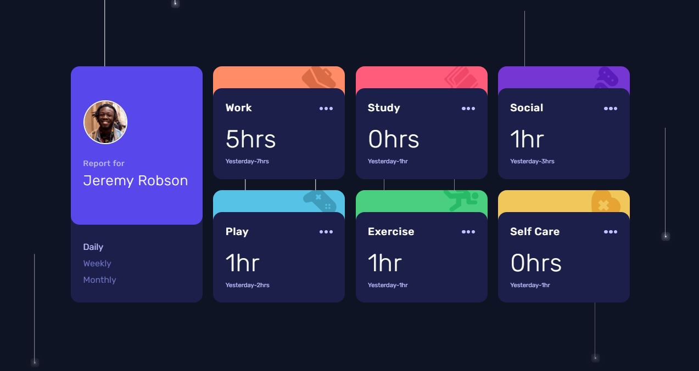

<h1 align="center">Time tracking dashboard
</h1>

 

   <a href="https://ahlam-alsaffarini.github.io/Time-tracking-dashboard/"> Demo 🔥🤍</a>

   Solution for a challenge from  <a href="https://www.frontendmentor.io/challenges/time-tracking-dashboard-UIQ7167Jw" target="_blank">frontendmentor.io</a>.

 
 

## Overview

### The challenge

This challenge is to build out this dashboard.

The user should be able to:

- View the optimal layout for the site depending on their device's screen size.
- See hover states for all interactive elements on the page.
- Switch between viewing Daily, Weekly, and Monthly stats.

### Built with

- Semantic HTML5 markup
- CSS custom properties
- Flexbox and grid system
- Mobile-first workflow
- js and json data

### Useful resources

- [MDN](https://developer.mozilla.org/en-US/)
- [stackoverflow](https://stackoverflow.com/)

## Acknowledgments

this was a great challenge for me <3

A big thank you to anyone providing feedback on my . It definitely helps to find new ways to code and find easier solutions!
